<h1 style="color:#C80D44">Bookstore</h1>

Bookstore is a online book shop seling a wide viriety of books for users to browse through and purchase.

## Functionality
### Guests
Guest users have access to the basic functionalities. Guests can browse through the catalog, view book details and add products to the shopping basket.

### Logged-in users
Logged users have access to the functionalities of guest users, with addition of creating, editing and deleting book reviews. Logged users can create and delete orders, as well as view a list of their orders in their profile page.


## Features
* Authentication
* CRUD operations for authenticated users
* Client-side routing
* Data validation
* react-hot-toast for notifications
* Catalog 
* Details page for each book
* Adding products to basket and creating orders 
* Profile page of user
* Details page for orders

## Setup
1. Clone repository

2. Open the *client* folder in a terminal and run the following commands
   ```bash
   npm install 
   npm run dev  
   ```

3. Open the *server* folder in another terminal and run the following command
    ```bash
    node .\server.js
    ```

4. You are ready


## Project overview

### Authentication
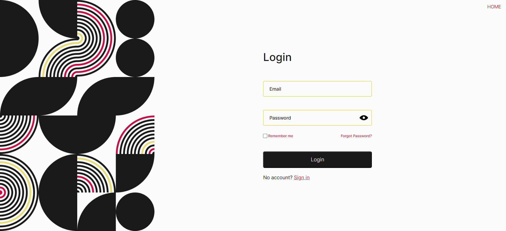  

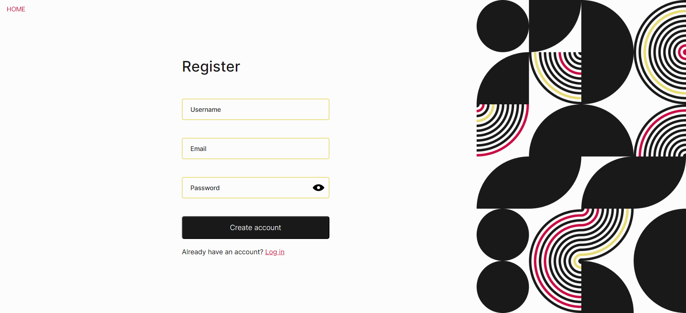  

### Home 
  

### Catalog
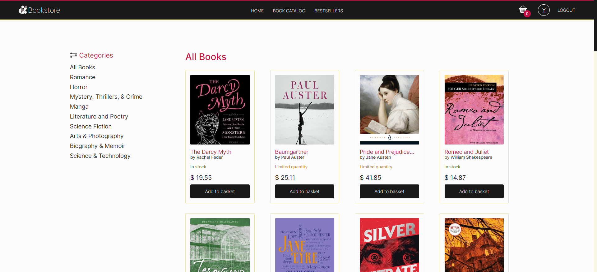  

### Books by category
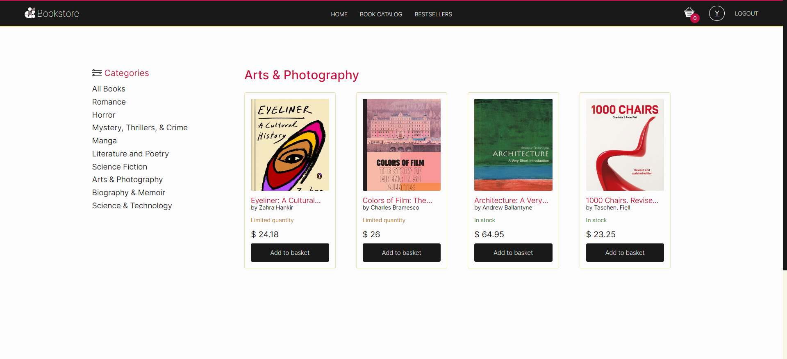  

### Book details
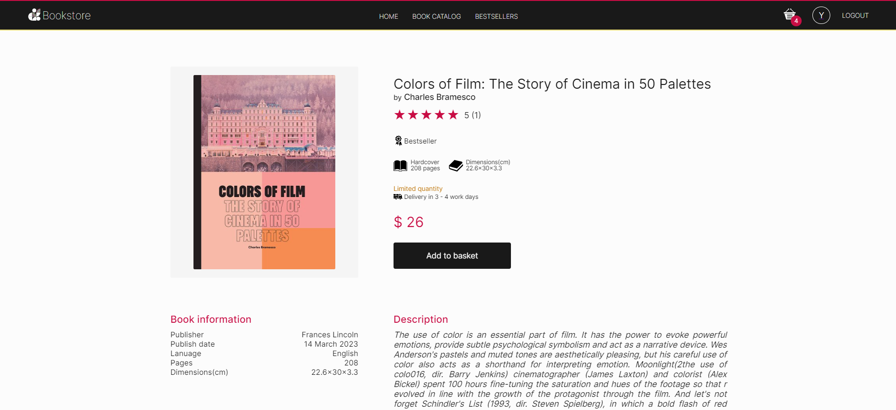  

### Reviews
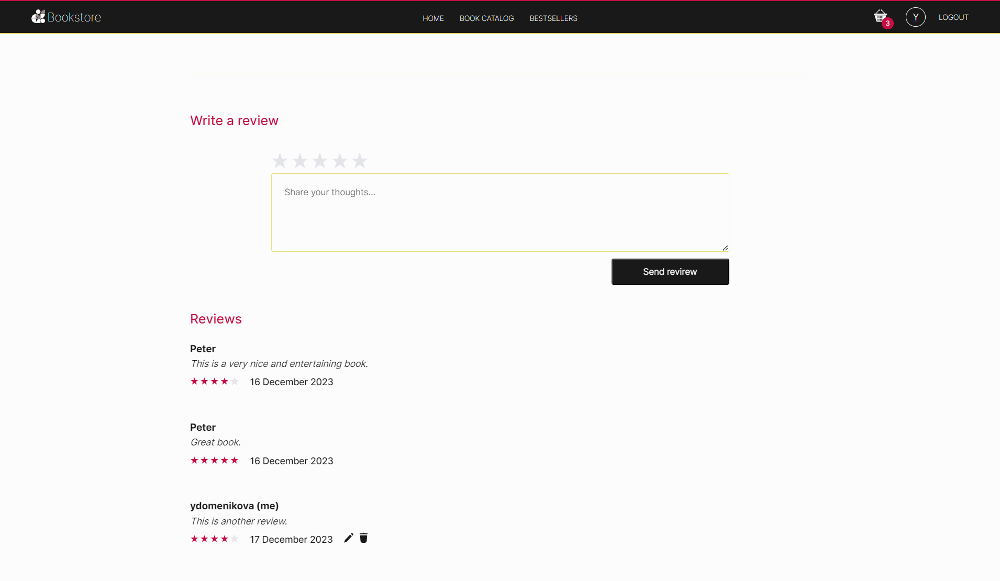 
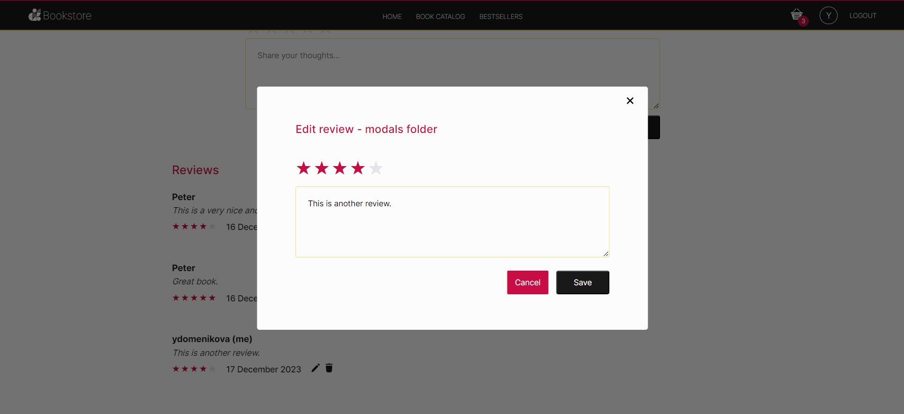  

### Shopping basket
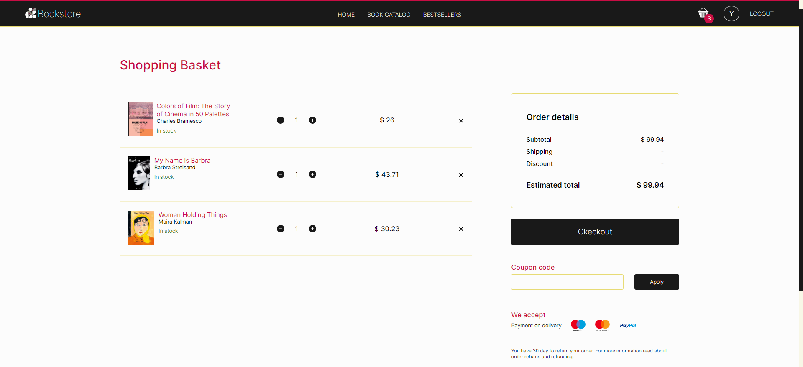  

### Checkout
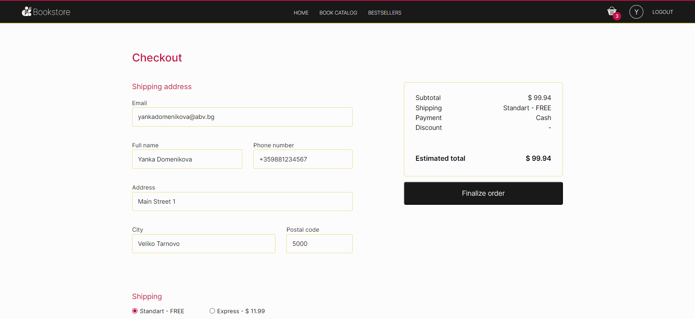  

### Order success
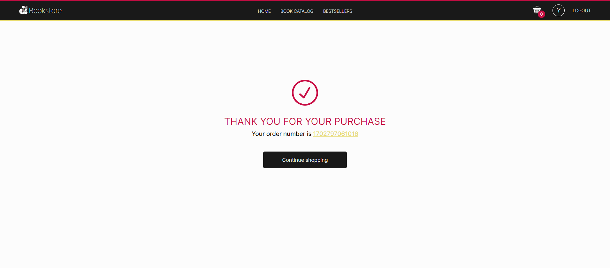  

### Profile
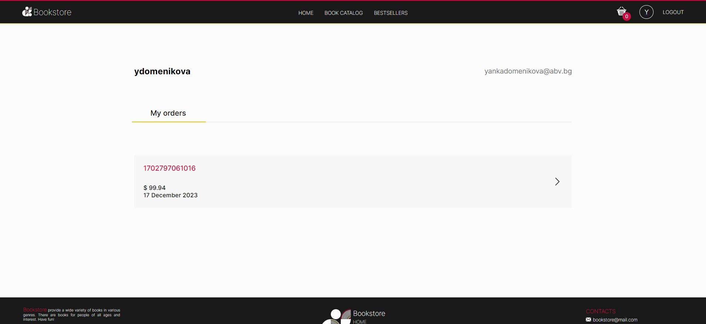  

### Order details
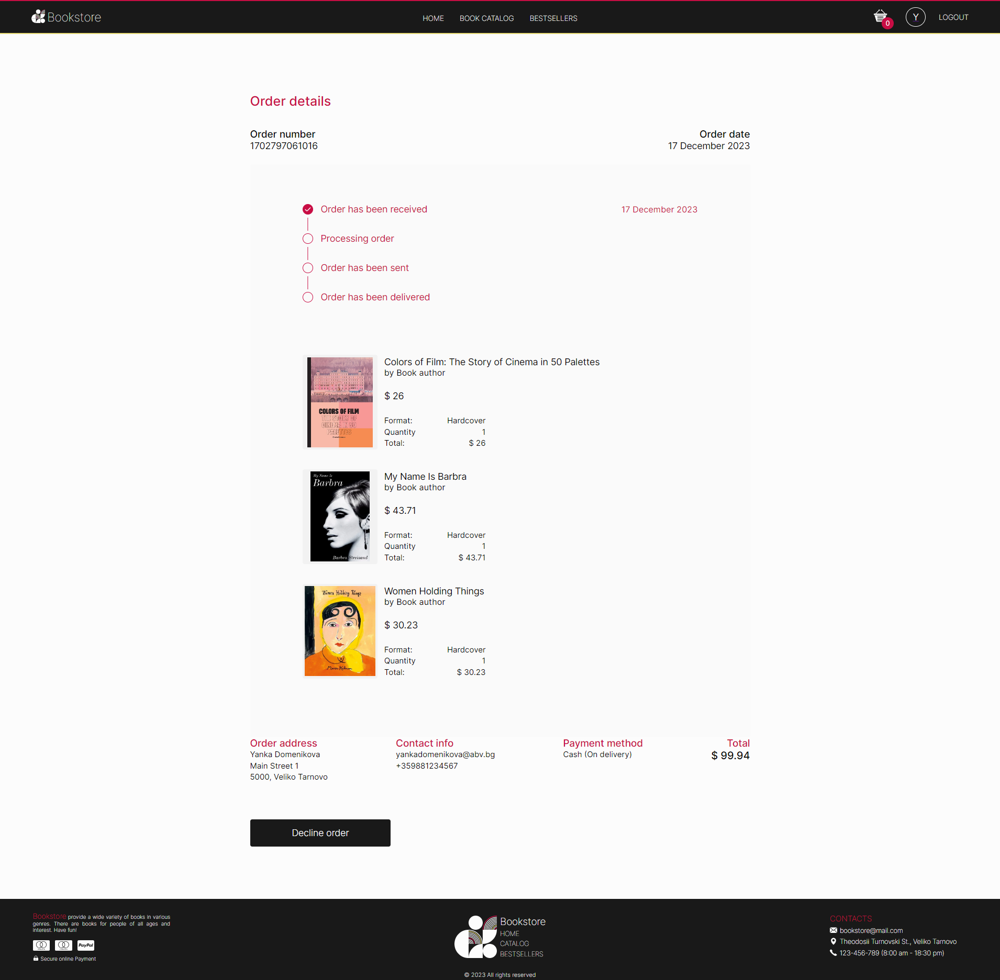  
